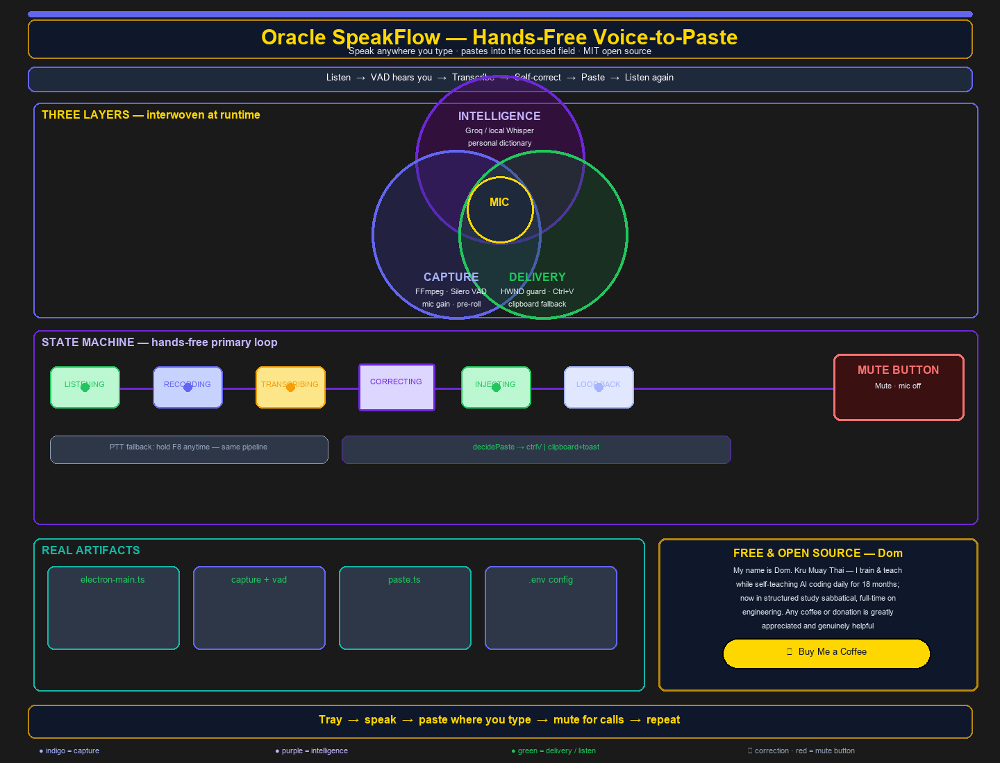
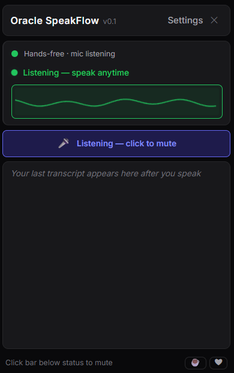

# Oracle SpeakFlow

<div align="center">



[](https://www.buymeacoffee.com/oraclespeakflow)
[](https://github.com/sponsors/DifTorHeSmushma)
[](LICENSE)

</div>

Fast voice-to-text for anyone who types: speak naturally — **hands-free** or with a hotkey — and your transcript is pasted into **whatever app already has focus** (IDE, browser, chat, docs, email, terminal, and more).

**Listen → Transcribe (Groq cloud or local Whisper) → Correct → Paste where you're typing**

<div align="center">



</div>

## About the developer

**My name is Dom.** I'm a **Kru Muay Thai** — I train and teach Muay Thai, and for the past **18 months** I've been **self-teaching AI coding every day**. I've recently moved into a more **structured study sabbatical**, full-time focused on building my development environment and tools like SpeakFlow.

Oracle SpeakFlow is **free and open source** — offered to anyone who wants hands-free voice input wherever they type.

Any assistance — buying me a coffee or a donation — is greatly appreciated and genuinely helpful.

[](https://www.buymeacoffee.com/oraclespeakflow)

**Workflow diagram:** [Indigo poster](docs/diagrams/Oracle_SpeakFlow_Workflow_Indigo.png) · [Excalidraw source](docs/diagrams/Oracle_SpeakFlow_Workflow_Indigo.excalidraw) · [Study map](docs/diagrams/Oracle_SpeakFlow_Workflow.md)

## Platform support

| Platform | Status | What you get |
|----------|--------|----------------|
| **Windows** | ✅ Shipped | NSIS installer (`npm run package`); bundled local Whisper (Fast tier); hands-free + paste |
| **macOS** | 🟡 Beta (CI-built) | `.dmg` + `.zip` from GitHub Actions **Mac Package** workflow (ad-hoc signed). Cloud transcription works; local Whisper not bundled on Mac yet. If Gatekeeper blocks: right-click → **Open**. |
| **Linux** | ⏳ In progress (M7) | Ubuntu CI runs tests on every push — **no installable build yet** |

> **Honest scope:** Windows is the full product today. macOS is a **proof build** (launch + cloud transcribe), not full parity. Linux packaging is the next milestone.

## Current release status

| Milestone | Status | What you get |
|-----------|--------|----------------|
| **Phase 3 Pro** | ✅ Shipped on `main` | Electron tray UI, F8 push-to-talk, waveform, MCP bridge, tabbed settings |
| **Quantum Leap — Wave 2** | ✅ Shipped + smoke-signed | Hands-free VAD (Silero), mute kill-switch, paste guard, HWND focus ladder |
| **Quantum Leap — Wave 3** | ✅ Shipped + smoke-signed | Voice settings UI, personal dictionary UI, listening indicator, NSIS packaging |
| **Local intelligence** | ✅ On `main` | Cloud vs Local mode, model downloader, whisper-cli sidecar wiring (Windows) |
| **Windows installer** | ✅ `npm run package` | NSIS (`dist-installer/`), bundled VAD model + ONNX runtime unpack |
| **macOS CI build** | ✅ Beta | `mac-package.yml` → DMG/ZIP artifacts; G23-runner bundle verify on cloud Mac |
| **Linux installer** | ⏳ M7 | Planned — AppImage/deb + native paste/hotkey/mic |

> **Repo visibility:** The GitHub repository may still be **private** during active development. Clone and the Sponsor button work once the repo is public. Support links below work regardless.

## Features

### Core (daily use)

- **Hands-free mode (primary):** Silero VAD detects speech start/stop — no hotkey required
- **Push-to-talk:** Default hotkey **F8** (hold to record, release to transcribe and paste)
- **Mute kill-switch:** Full-width mute bar closes the mic device (OS mic dot goes dark)
- **Listening indicator:** Mic/mute state + one-time privacy explainer on first launch
- **Groq cloud transcription:** Low-latency Whisper via API (free tier supported)
- **Deterministic correction:** Whitespace + dev-term casing (`TypeScript`, `npm`, etc.)
- **Personal dictionary:** Spoken → written replacements (JSON import/export)
- **Direct paste:** Foreground-window guard + clipboard + Ctrl+V (Shift+Insert option for terminals)
- **System tray UI:** Compact panel (320×500) with live status, waveform, transcript preview

### Settings (tabbed modal)

| Tab | Contents |
|-----|----------|
| **Voice** | Hands-free / PTT, VAD sliders, kill-switch info, hotkey editor, terminal paste mode |
| **Dictionary** | Add/edit entries, phrase vs word match, import/export JSON |
| **Engine** | Groq model, language, Cloud vs Local transcription, model downloader |
| **Account** | Groq API key |
| **Support** | Buy Me a Coffee, GitHub Sponsors, repo link |

### Pro / integrations

- **Dark theme** with shared design tokens (zinc / indigo)
- **Real-time waveform** while listening and recording
- **MCP headless server** (`--mcp`): transcript tools for AI agents
- **Configurable hotkey** with one-time migration from legacy Ctrl+Alt+* bindings

### Local intelligence

- **Transcription mode:** Cloud (Groq) or Local (Whisper sidecar)
- **Model downloader:** `ggml-tiny.en.bin` to user data with SHA-256 verification
- **Offline path** when local model + `whisper-cli.exe` are present

## Quick start (developers)

### 1. Clone and install

```bash
git clone https://github.com/DifTorHeSmushma/oracle-speakflow.git
cd oracle-speakflow
npm install
```

### 2. API key (Groq — cloud mode)

Config is stored under `%APPDATA%\oracle-speakflow\` (Windows):

- `.env` — API key, voice mode, VAD, hotkey
- `dictionary.json` — personal dictionary (separate file, survives upgrades)

On first run, open the tray UI → **Settings → Account**, or set:

```env
GROQ_API_KEY=your_key_here
```

Get a free key at https://console.groq.com/

### 3. Build and run

**After `git pull` or code changes:**

```bash
npm run start:app
```

**Daily launch** (no rebuild):

```bash
npm run start:electron
```

Equivalent manual steps: `npm run build && npm run build:ui && npm run start:electron`

### 4. Use it

1. Click the **system tray** icon.
2. Focus the **text field** where you want dictation (any app).
3. **Speak** (hands-free) or **hold F8** → speak → **release**.
4. Click the **mute bar** before calls or when you need privacy.
5. Open **Settings** for voice mode, dictionary, engine, and API key.

**Alt-tab safety:** Stay in your target window while speaking. If you switch apps mid-utterance, text goes to the **clipboard** with a toast — never the wrong window. Press Ctrl+V where you want it.

### Local mode

1. Settings → **Engine** → **Local (Whisper)**.
2. **Download Model** (first time).
3. Place **`whisper-cli.exe`** in `resources/bin/` (not downloaded by the app).
4. Use hands-free or F8 as usual.

### Windows installer

```bash
npm run package
```

Output: `dist-installer/Oracle SpeakFlow Setup *.exe`. User data in `%APPDATA%\oracle-speakflow` is **not** wiped on upgrade.

## How it works

```
LISTENING ──(speech)──► RECORDING ──(silence)──► TRANSCRIBING ──► CORRECTING ──► INJECTING ──► LISTENING
         PTT: F8 down ──► RECORDING ──(F8 up)──► … same pipeline …
```

- **Capture:** FFmpeg (bundled or PATH) + Silero VAD ONNX
- **Transcription:** Groq API (remote) or `whisper-cli.exe` (local)
- **Correction:** Deterministic rules → personal dictionary (authoritative last)
- **Injection:** Mute check → foreground guard → clipboard + nut-js paste

See the [workflow diagram](docs/diagrams/Oracle_SpeakFlow_Workflow_Indigo.png) for the full architecture.

### Key paths

| Path | Role |
|------|------|
| `src/electron-main.ts` | Main process, state machine, pipeline, IPC |
| `src/preload.cts` | Renderer bridge (`window.electronAPI`) |
| `src-ui/` | Svelte tray UI |
| `src/services/` | Capture, VAD, transcription, correction, dictionary, paste |
| `docs/DESIGN/` | PRDs, Quantum Leap spec, smoke sign-off |
| `docs/diagrams/` | Excalidraw workflow poster |

## Development

### Prerequisites

- Node.js **20+**
- **Windows** — primary dev and ship target
- **macOS** — CI packages via `Mac Package` workflow; local Mac dev optional
- **Linux** — CI test matrix only until M7 ships an installer
- FFmpeg on PATH for dev, or `resources/bin/ffmpeg.exe` (Windows)
- Groq API key for cloud mode (required on macOS beta; optional on Windows if using local mode)

### Scripts

```bash
npm run start:app        # Rebuild + launch (after code changes)
npm run start:electron   # Launch only (daily use)
npm run typecheck        # TypeScript
npm test                 # Unit tests (138)
npm run test:ui          # Svelte component tests (38)
npm run test:integration # Playwright + Electron
npm run build            # Compile main process
npm run build:ui         # Build tray UI → dist-ui/
npm run package          # electron-builder → dist-installer/
```

### Validation gates (before merge)

```bash
npm run typecheck && npm test && npm run test:ui && npm run test:integration
```

## Configuration (user data)

| Variable / file | Purpose |
|-----------------|---------|
| `GROQ_API_KEY` | Groq API key (required for cloud mode) |
| `SPEAKFLOW_VOICE_MODE` | `handsFree` (default) or `ptt` |
| `SPEAKFLOW_HOTKEY` | JSON hotkey config (default F8) |
| `SPEAKFLOW_VAD` | JSON VAD tuning (thresholds, hangover, pre-roll) |
| `SPEAKFLOW_CORRECTION` | JSON correction config (`llmEnabled` off by default) |
| `SPEAKFLOW_TERMINAL_VARIANT` | `true` = Shift+Insert in terminals |
| `SPEAKFLOW_FIRST_RUN_DISMISSED` | One-time privacy explainer dismissed |
| `SPEAKFLOW_TRANSCRIPTION_MODE` | `remote` or `local` |
| `SPEAKFLOW_MODEL` | Groq model id |
| `SPEAKFLOW_LANGUAGE` | Language code |
| `dictionary.json` | Personal dictionary (import/export via Settings) |

Location: `%APPDATA%\oracle-speakflow\`

## MCP (AI agents)

Headless stdio server for Claude Desktop, IDE agents, and other MCP clients:

```bash
npm run build
electron dist/electron-main.js --mcp
```

See `docs/DESIGN/MILESTONE_3_PRD.md`.

## Troubleshooting

| Symptom | What to try |
|---------|-------------|
| UI looks old / no waveform | `npm run start:app` after `git pull`; kill stale `electron.exe` |
| “Sometimes works, sometimes not” | One instance only (tray → Quit); check `.env` for API key |
| Paste goes to wrong window | Focus target field before speaking; alt-tab → clipboard fallback |
| Local mode fails | Download model in Settings; add `whisper-cli.exe` to `resources/bin/` |
| Old installed `.exe` shows stale UI | Uninstall `%LOCALAPPDATA%\Programs\Oracle SpeakFlow\`; use dev launch |

## Roadmap

- [x] **Phase 1–2:** Daemon, Groq transcription, Electron tray UI
- [x] **Phase 3 Pro:** F8 default, waveform, MCP, design tokens, settings
- [x] **Quantum Leap Wave 2:** Hands-free VAD, mute, paste guard, correction pipeline
- [x] **Quantum Leap Wave 3:** Voice + dictionary settings UI, installer bundling
- [x] **Local intelligence:** Cloud/local mode + model downloader
- [x] **Visual redesign:** shadcn-svelte Card layout, tabbed Settings Dialog
- [x] **macOS (M6):** CI-built DMG/ZIP + G23-runner verify — beta, cloud path (proof not parity)
- [ ] **Linux (M7):** Installable build + native paste/hotkey/mic
- [ ] **macOS parity (M7):** Native paste, hotkeys, mic, bundled local Whisper
- [ ] **LLM correction pass:** Opt-in polish (not implemented; adds cost + latency)

## Contributing

See [CONTRIBUTING.md](CONTRIBUTING.md) and [CLAUDE.md](CLAUDE.md) (invariants and architecture).

## Privacy

- Audio sent to **Groq** only in **cloud** mode.
- **Local** mode processes audio on device when configured.
- No transcript text logged to disk by default.
- API key stored in user data (keychain deferred — see `docs/DESIGN/ADR-0001-nfr04-keychain-deferral.md`).

## Support the project

Oracle SpeakFlow is **free and MIT open source**. If it saves you time, consider supporting development during my study sabbatical.

[](https://www.buymeacoffee.com/oraclespeakflow)
[](https://github.com/sponsors/DifTorHeSmushma)

GitHub also shows a **Sponsor** button via [`.github/FUNDING.yml`](.github/FUNDING.yml) (`buy_me_a_coffee: oraclespeakflow`, `github: DifTorHeSmushma`).

## License

MIT — see [LICENSE](LICENSE)

---

Built for accessible, flow-state voice input — wherever you type.
